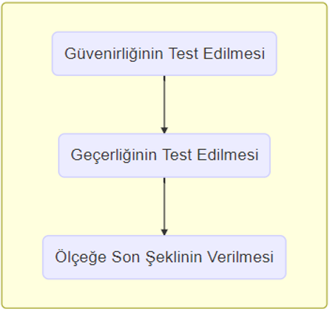

class: highlight-last-item

# Ölçme Nedir?

--

* Ölçme, evrende mevcut ve araştırma konusu olan olay, olgu, nesne ve varlıkların ve niteliklerinin gözlenip gözlem sonuçlarının sayılarla veya başka sembollerle gösterilmesidir (Turgut, 1984; Bayat, 2014). 

--
<br>

Ölçme işlemi  iki farklı şekilde yapılabilir.

--

.pull-left[

* Doğrudan 

```{r echo = FALSE, out.width ="35%"}

```
]

???

Doğrudan ölçme: ölçmek istenilen özellik doğrudan gözlenerek ya da bu özelliğin kendisiyle doğrudan ilişkili bir ölçme aracı ile ölçülebiliyorsa
Ölçülen özellik dışında bir başka özelliğin ölçme işlemine karışmamasıdır!

--
.pull-right[

* Dolaylı 

```{r echo = FALSE, out.width ="30%"}

```
]

???

Dolaylı ölçme: bir özellik doğrudan gözlemlenemez ve ölçülemez, ancak başka bir özellik yardımıyla dolaylı olarak ölçülebilmektedir. Örneğin;
“Havanın sıcaklığını termometre ile ölçmek” cıva ya da alkolün sıcaklıkla genleşerek boru içinde yükselmesiyle oluşan yüksekliğe bağlı
“Öğrencinin Türkçe dersindeki başarısını ölçmek” Türkçe başarısı doğrudan gözlemlenemez, ancak var olduğu düşünülür, sorulara verdiği cevaplarla gözlemlenmeye çalışılır.

---

# Ölçekler ve Özellikleri:


Ölçekler, gizil değişkenler olarak da adlandırılan ve bireylerin doğrudan gözlenemeyen özelliklerini ölçmek için tasarlanmış ölçme araçlarıdır (Erkuş, 2012; Kyriazos & Stalikas, 2018).

--

.center["Scale" /  "Questionnaire"  / "Test"]


--

Araştırmalarda kullanılan ölçekler iki türlü elde edilmektedir. 

--

  * Başka bir dilde geliştirilmiş bir ölçeğin uyarlanması 

--

  * Yeni bir orijinal ölçeğin geliştirilmesi
---

# Ölçekler ve Özellikleri (Devam):

Ölçeklerin sağlaması gereken iki temel özellik vardır.

--

1- Geçerlik


--

2- Güvenirlik
 
---

# Ölçekler ve Özellikleri (Devam):

Ölçeklerin sağlaması gereken iki temel özellik vardır.

1- Geçerlik

Bir ölçme aracının ölçmeyi amaçladığı özelliği, başka herhangi bir özellikle karıştırmadan, doğru ölçebilme derecesidir (Karakoç & Dönmez, 2014). 

---

 
# Ölçekler ve Özellikleri (Devam):

Ölçeklerin sağlaması gereken iki temel özellik vardır.


1- Geçerlik

Bir ölçme aracının ölçmeyi amaçladığı özelliği, başka herhangi bir özellikle karıştırmadan, doğru ölçebilme derecesidir (Karakoç & Dönmez, 2014). 


2- Güvenirlik

Ölçme aracın, ölçmek istediği değişkeni ne tutarlılıkla ölçtüğünün ya da ölçme sonuçlarının hatalardan arınmış olmasının derecesidir (DeVellis, 2003; Karakoç & Dönmez, 2014; Theodoros & Stalikas, 2018). 
---

# Ölçekler ve Özellikleri (Devam):

--

* Gerek yeni geliştirilmiş gerekse uyarlama yoluyla elde edilen ölçeklerin kullanıldığı araştırma bulgularının genellenebilirliği, işlevselliği ve sağlamlığı da kullanılan bu ölçme araçlarının güvenirliği ve geçerliğiyle paralellik göstermektedir (Erkuş, 2007). 

--

* Bir ölçeğin geçerli ve güvenilir olması için, ölçeğin geliştirilmesi ve kullanılması aşamalarında birçok kriter ve standarda uygun çalışılması ve yorum yapılması gerekmektedir (Karakoç & Dönmez, 2014).

---

## Ölçek Geliştirme Adımları:


```{r echo = FALSE, out.width = "900px", out.height = "450px"}

```

<font size="6"> _Kaynak: (Kyriazos & Stalikas, 2018)_


???

Ölçek geliştirmeye karar veren araştırmacının dokuz aşamayı izlemesi beklenir (DeVellis, 2003)

---

# Ölçek Geliştirme Adımları (Devam):

```{r echo = FALSE, out.width = "900px", out.height = "450px"}

```

???

Ölçek geliştirmeye karar veren araştırmacının dokuz aşamayı izlemesi beklenir (DeVellis, 2003)

---
# Ölçek Geliştirme Adımları (Devam):

.three-column[

Ölçek Maddelerinin Geliştirilmesi

```{r echo = FALSE, out.width ="95%"}

```
]

--

.three-column[

Ölçeğin Uygulanması 

<br> 

```{r echo = FALSE, out.width ="100%"}

```
]

--

.three-column[

Ölçeğin Değerlendirilmesi

```{r echo = FALSE, out.width ="95%"}

```
]


```{r eval=FALSE, fig.align='center', message=FALSE, warning=FALSE, include=FALSE, out.width="200%"}
# Conclude the subgraph
  "end") %>%
  # remember to bind it together
  paste(collapse = "\n")

subgraph_phase2<- c(
  # Make another subgraph
  "subgraph Ölçeğin Denenmesi",
    "S4[Örneklem Büyüklüğünün Belirlenmesi]",
    "S5[Ölçeğin Hedef Kitle Üzerinde Denenmesi]",
  # Conclude subgraph
  "end") %>%
  # Bind it!
  paste(collapse = "\n ")

subgraph_phase3 <- paste(
  # Make another subgraph
  "subgraph Geçerlik ve Güvenirliğinin Test Edilmesi",
    # Draw events as boxes with []
    "S6[Güvenirliğinin Test Edilmesi]",
    "S7[Geçerliğinin Test Edilmesi]",
    "S8[Ölçeğe Son Şeklinin Verilmesi]",
  # Conclude the subgraph
  "end",
  sep = "\n ")

ties  <- paste(
  "S1--> S2",
  "S2 --> S3",
  "S3 --> S4",
  "S4 --> S5",
  "S5 --> S6",
  "S6 --> S7",
  "S7 --> S8",
  sep = "\n ")

c(intro, 
    # Add subgraphs of nodes
    subgraph_phase1,
    subgraph_phase2,
    subgraph_phase3,
    # Add ties
ties) %>%
  # Paste them together
  paste(collapse = "\n ") %>%
  # And visualize it!
  mermaid()
```

---
## Aşama 1 - Ölçek Maddelerinin Geliştirilmesi
#### _Adım 1- Ölçülmek istenen yapının / kavramsal çerçevesinin tanımlanması_

--

* Neden bir ölçek geliştirilmek isteniyor? 

--

* Yeni bir ölçme aracına ihtiyacına var mı?

--

* Geliştirilecek bu ölçek neyi ölçecek?

--

* Ölçeğin hedef kitlesi kimler?

--

* Ölçeğin boyutları neler?
--

* Ölçeğin süresi önemli mi?

<font size="5"> _Kaynak: (Erkuş, 2012; Şahin & Öztürk, 2018; Yalçın, 2019; Totan, 2022)_

---

## Aşama 1 - Ölçek Maddelerinin Geliştirilmesi
#### _Adım 2- Madde Havuzunun Oluşturulması_

* Literatür taraması 

* Benzer ölçeklerin incelenmesi

* Uzman görüşleri  (Odak grup tartışmaları)

<br>

_Kaynak:  (Boateng, 2018; Şahin & Öztürk, 2018)_

---

## Aşama 1 - Ölçek Maddelerinin Geliştirilmesi
#### _Adım 2- Madde Havuzunun Oluşturulması (Devam)_

--

* Maddeler yazılırken ölçülmek istenen yapının tüm alt boyutları kapsanmalıdır (Tezbaşaran, 2008). 

--

* Madde sayısı, sonunda elde edilmek istenen ölçeğin en az iki katı uzunluğunda olmalıdır (Kline, 1993; Boateng, 2018) .

--

* Ölçülmek istenen özelliği ölçmek için farklı türde maddeler yazılabilir. <br>
(İki seçenekli, çoktan seçmeli, dereceleme türü, eşleştirmeli gibi) (Erkuş, 2012)

--

* Madde formatı seçilirken hedef grubun özellikleri gözetilmelidir (Yalçın, 2019).
---

## Aşama 1 - Ölçek Maddelerinin Geliştirilmesi
#### _Adım 2- Madde Havuzunun Oluşturulması (Devam)_

* Maddelerdeki ifadeler ölçülmek istenen niteliğe yönelik olmalıdır. 

* Bir madde birden fazla özelliği ölçmemelidir. 

* Ölçek maddeleri kısa ve anlaşılır olmalıdır. 

* Aynı madde içerisinde iki tane olumsuz ifade olmamalıdır.

<br>

_Kaynak: (Yalçın, 2019)_

---

## Aşama 1 - Ölçek Maddelerinin Geliştirilmesi
#### _Adım 3- Kapsam / Görünüş /Dil Geçerliğinin Test Edilmesi_ 

<br>

--

__Kapsam Geçerliği:__ Madde örnekleminin yeterliliği yani maddelerin, ölçülmek istenen yapıyı ne derece yansıttığı ile ilgilidir (Ercan, 2004).

--

_Uzman (5-7 uzman) görüşlerine başvurulur. Kapsam geçerlik indeksi (KGİ), kapsam geçerlik oranı (KGO), Delphi tekniği (Boateng, 2018)_

---

## Aşama 1 - Ölçek Maddelerinin Geliştirilmesi
#### _Adım 3- Kapsam / Görünüş /Dil Geçerliğinin Test Edilmesi (Devam)_ 

<br>

--

__Görünüş Geçerliği:__ Ölçme aracının neyi ölçtüğünü değil de neyi ölçer göründüğünü belirtmektedir (Ercan, 2004). 

--

_Hedef gruba ön deneme yapılır. 5-15 görüşmeci yeterlidir(Boateng, 2018)._

---

## Aşama 1 - Ölçek Maddelerinin Geliştirilmesi
#### _Adım 3- Kapsam / Görünüş /Dil Geçerliğinin Test Edilmesi (Devam)_ 

<br>

--

__Dil Geçerliği:__ Ölçeğin maddelerinin, Türkçe dil yapısına uygunluğu, anlaşılabilirliği açısından değerlendirilmesi


--

_Dil uzmanlarının görüşlerine başvurulur._

--

_Hedef gruba ön deneme yapılır._
---

## Aşama 2 - Ölçeğin Uygulanması

#### _Adım 4- Örneklem Büyüklüğünün Belirlenmesi_ 

--

* Madde sayısının en az 10 katı olmalı (Nunnally, 1978).

--

* Minimum 300-450 arası (Guadagnoli and Velicer, 1988).

--

* 100 = zayıf, 200 = orta, 300 = iyi, 500 =çok iyi, 1,000 = mükemmel (Comrey & Lee, 1992).

--

* Madde azaltılması için yapılacak istatistiksel analizler (paralel analiz, bootstrap gibi) için çok daha fazla örneklem büyüklüğü gereklidir (Boateng, 2018).

---


## Aşama 2 - Ölçeğin Uygulanması

#### _Adım 5- Ölçeğin Hedef Kitle Üzerinde Denenmesi_

* Belirlenen örneklem büyüklüğü, hedef kitleyi yansıtacak ya da temsil edecek bir örneklem üzerinde uygulanır.

--

* Ölçek, hedef kitlenin yapısına ve ölçeğin amacına uygun bir yöntem kullanılarak uygulanır.

--

  * _Görüşme, kendi kendine doldurma tablet vb._ 

--

* Test-tekrar test güvenirliği için ölçek belirli bir süre sonra hedef gruba tekrar uygulanır.

---

## Aşama 3 - Ölçeğin Değerlendirilmesi


* Madde analizleri ile işlemeyen maddeler belirlenmeye çalışılır.

--

.center[ Klasik Test Kuramı ya da Madde Tepki Kuramı ]

--

  * Madde güçlük ve ayırtedicilik indeksleri

--
  
  * Çeldiricilik analizleri
  
--
  
  * Madde toplam korelasyonları <br> (Kategorik veriler için poliserial, Binary veriler için biserial) 


---

## Aşama 3 - Ölçeğin Değerlendirilmesi

#### _Adım 6- Ölçeğin Güvenirliğinin Gösterilmesi_

--

* İç tutarlılık

--

  Cronbach's alpha, Omega katsayısı, KR 20-21, iki yarı güvenirliği

--

* Test-tekrar test

--

  Sınıf içi korelasyon katsayısı (ICC), Paralel formlar

---

## Aşama 3 - Ölçeğin Değerlendirilmesi

#### _Adım 7- Ölçeğin Geçerliğinin Gösterilmesi_

__Yapı Geçerliği:__ Ölçeğin ölçmek istediği yapıyı ölçüp ölçmediği yapı geçerliği olarak adlandırılır.

--

* Açımlayıcı faktör analizi <br> Özdeğer, scree plot, açıklanan varyans, faktör yükleri

--

* Doğrulayıcı faktör analizi <br> Model uyum indeksleri (RMSEA, Kikare/sd, CFI, GFI vb.)

---


## Aşama 3 - Ölçeğin Değerlendirilmesi

#### _Adım 8- Ölçeğe Son Şeklinin Verilmesi_

İşlemeyen maddelerin atıldığı ve geçerliği-güvenirliği gösterilen ölçeğin;

--

* Puanlaması yapılır ve nasıl yorumlanacağı açıklanır. <br> Maddelerden alınan ham puanlar, faktör yükleri, madde tepki kuramına göre 


--

* Kesim noktası bulunabilir.

--

* Ölçeğin uygulama ve puanlama yönergesi hazırlanır.
---

# HÜ-SOY Ölçeği Geliştirme Adımları:

.center[“Türkçe konuşan, okuryazar erişkinlere özgü geliştirilen sağlık okuryazarlığı ölçeği (HÜ-SOY Ölçeği)”]

<br>

Araştırma Ekibi: 

.pull-left[
* Prof. Dr. Şevkat BAHAR ÖZVARIŞ
* Prof. Dr. Bahar GÜÇİZ DOĞAN
* Prof. Dr. Nuri DOĞAN
* Doç. Dr. Özge KARADAĞ ÇAMAN
]

.pull-right[
* Prof. Dr. Sibel SAKARYA
* Prof. Dr. Selahattin GELBAL
* Öğr. Gör. Dr. Hande KONŞUK ÜNLÜ
]
---

# HÜ-SOY Ölçeği Geliştirme Adımları:

Sağlık okuryazarlığı (health literacy), bireylerin sağlığını geliştirici şekilde temel sağlık bilgilerini ve hizmetlerini edinebilme, yorumlayabilme ve anlayabilme kapasitesi olarak tanımlanmaktadır.

--

Sağlık okuryazarlığı düzeyinin düşük olmasının, sağlık bilgilerini anlama, hizmetlere ulaşma ve bu hizmetleri kullanma ile sağlık önerilerini yerine getirme konusunda ciddi sorunlara neden olduğunu literatürde birçok çalışmada belirtilmiştir.
---

## HÜ-SOY Ölçeği Geliştirme Adımları:

### Aşama 1: 

* Var olan ölçeklerin hepsi Türkçe'ye uyarlanmış ölçekler <br> Türk kültürüne uyum sorunu

* Var olan ölçeklerin bazılarının içeriğinin ilgili yapıyı tam olarak açıklayamaması

* Var olan ölçeklerin bazılarının uygulanış biçiminin uygun olmaması <br> Görüşmeci yoluyla verilerin toplanması

---

## HÜ-SOY Ölçeği Geliştirme Adımları:

### Aşama 1: 

```{r echo = FALSE, out.width ="95%"}
knitr::include_graphics("img/Bloom_taksonomi.png")
```
---

## HÜ-SOY Ölçeği Geliştirme Adımları:

### Aşama 1: 

* Araştırma ekibi tarafından taslak bir madde havuzu oluşturulmuştur.


* Birinci Hazırlık Çalıştayı (20 Uzman) <br> _Sağlık (halk sağlığı uzmanları, aile hekimleri, hemşireler, ebeler)_ <br> _Sosyal bilimler (halk
bilimi uzmanları, sosyologlar, Türk dili ve edebiyatı uzmanları, iletişim uzmanları)_ <br> _Ölçme değerlendirme uzmanları_

* Birinci ön deneme (20 görüşmeci) <br> 404 maddelik ilk taslak

---

## HÜ-SOY Ölçeği Geliştirme Adımları:

### Aşama 1: 

* Revize edilmiş ölçek ile ikinci ön deneme 15 kişi ile

* İkinci Hazırlık Çalıştayı (20 Uzman) <br> Madde analizleri - Güvenirlik katsayıları

* Üçüncü ön deneme (150 görüşmeci) -  243 maddelik ikinci taslak <br>
Ankara'nın Gölbaşı ilçesinde

* Ön deneme sonuçlarının değerlendirilmesi (Araştırma ekibi tarafından) <br>
Madde analizleri -- 110 maddelik HÜ-SOY ölçek + 20 maddelik öz yeterlilik


---

## HÜ-SOY Ölçeği Geliştirme Adımları:

### Aşama 2: 

* 12 İBB biriminden (Düzey-1) uygunluk örneklemesine göre birer il seçildi. <br>
Adana, Ankara, Balıkesir, Batman, Bursa, Erzurum, İstanbul, İzmir, Kayseri, Malatya, Samsun, Trabzon

* Anketör - denetçi eğitimi ve pilot uygulama <br>
12 anketör, 12 denetçi ve 1 saha koordinatörü

* 3 yaş bandından (18-29, 30-44, 45-60) 100 kadın 100 erkek toplam 2400 kişi

* 2466 kişi ile saha araştırması tamamlandı.

---

## HÜ-SOY Ölçeği Geliştirme Adımları:

### Aşama 3:

* Madde analizleri <br>

    * Madde güçlük ve ayırtedicilik indeksleri
    * Çeldiricilik analizleri
    * Madde toplam korelasyon katsayısı
    
    
* Güvenirlik katsayıları <br>

    * Cronbach's alpha
    
Bu analizler için IBM SPSS ver. 23.0 ve jMetrik ver. 4.1.1 paket programları kullanılmıştır.    
---

## HÜ-SOY Ölçeği Geliştirme Adımları:

### Aşama 3:

Madde analizleri ve araştırma ekibi tarafından madde analizleri sonucunda 

+ 71 maddeden oluşan HÜ-SOY 
+ 16 maddeden oluşan öz yeterlilik 

tetrakorik ve biserial korelasyonlara dayalı geçerlik ve güvenirlik analizleri yapılmıştır.

Bu analizler için FACTOR ver 10.8.02 programı ve R programlama dili ver. 4.0.0 kullanılmıştır.

---
## HÜ-SOY Ölçeği Geliştirme Adımları:

### Aşama 3: Güvenirlik Sonuçları -- HÜ-SOY Ölçeği

```{r echo = FALSE, out.width ="95%"}
knitr::include_graphics("img/hu_soy_guvenirlik.png")
```
---

## HÜ-SOY Ölçeği Geliştirme Adımları:

### Aşama 3: Güvenirlik Sonuçları -- Öz Yeterlilik Ölçeği

```{r echo = FALSE, out.width ="95%"}
knitr::include_graphics("img/ozyeterlilik_guvenirlik.png")
```
---

## HÜ-SOY Ölçeği Geliştirme Adımları:

### Aşama 3: Geçerlik Sonuçları -- HÜ-SOY Ölçeği

```{r echo = FALSE, out.width ="580px"}
knitr::include_graphics("img/hu_soy_gecerlik.png")
```
---

## HÜ-SOY Ölçeği Geliştirme Adımları:

### Aşama 3: Geçerlik Sonuçları -- Öz Yeterlilik Ölçeği

```{r echo = FALSE, out.width ="580px"}
knitr::include_graphics("img/ozyeterlilik_gecerlik.png")
```
---


.center[
<font size = "8"> __“Türkçe konuşan, okuryazar erişkinlere özgü geliştirilen sağlık okuryazarlığı ölçeği <br> (HÜ-SOY Ölçeği)”__
]

<br>

Kitap: <a href="https://fs.hacettepe.edu.tr/halksagligiens/dosyalar/SOY-kitap_baski%20.pdf"> HÜ-SOY TÜRKİYE’DE OKURYAZAR ERİŞKİN YAŞ GRUBUNA ÖZGÜ SAĞLIK OKURYAZARLIĞI ÖLÇEĞİ </a>

TOAD: <a href="https://toad.halileksi.net/olcek/hacettepe-universitesi-saglik-okuryazarligi-olcegi-hu-soy-olcegi/"> Hacettepe Üniversitesi Sağlık Okuryazarlığı Ölçeği (HÜ-SOY Ölçeği) </a>

Makale: <a href="https://pubmed.ncbi.nlm.nih.gov/35025613/"> Development and Validation of a Culture-Sensitive Generic Health Literacy Scale in Turkish-Speaking Adults </a>
---

## Kaynaklar:

* <font size="5"> Çaparlar, C. Ö., & Dönmez, A. (2016). Bilimsel araştırma nedir, nasıl yapılır. Turk J Anaesthesiol Reanim, 44(4), 212-8.
* <font size="5"> Turgut, M. F. (1993). Eğitimde ölçme ve değerlendirme metotları (İkinci Baskı), Saydam Matbaacılık, Ankara.
* <font size="5"> Bayat, B. (2014). Uygulamalı sosyal bilim araştırmalarında ölçme, ölçekler ve “Likert” ölçek kurma tekniği. Gazi Üniversitesi İktisadi ve İdari Bilimler Fakültesi Dergisi, 16(3), 1-24.
* <font size="5"> Erkuş, A. (2012). Psikolojide ölçme ve ölçek geliştirme-1: Temel kavramlar ve işlemler. Ankara: Pegem Akademi.
* <font size="5"> Kyriazos, T. A., & Stalikas, A. (2018). Applied psychometrics: The steps of scale development and standardization process. Psychology, 9(11), 2531.
* <font size="5"> Karakoç, F. Y., & Dönmez, L. (2014). Ölçek geliştirme çalışmalarında temel ilkeler. Tıp Eğitimi Dünyası, 13(40), 39-49.

---

## Kaynaklar (Devam):

* <font size="5"> Erkuş, A. (2007). Ölçek geliştirme ve uyarlama çalışmalarında karşılaşılan sorunlar. Türk Psikoloji Bülteni, 13(40), 17-25.
* <font size="5"> DeVellis, R. F. (2003). Scale development theory and applications (Second Edition). SAGE Publication, Inc.
* <font size="5"> Boateng, G. O., Neilands, T. B., Frongillo, E. A., Melgar-Quiñonez, H. R., & Young, S. L. (2018). Best practices for developing and validating scales for health, social, and behavioral research: a primer. Frontiers in public health, 6, 149
*  <font size="5"> Yalçın, S. (2019). BİLİMSEL ARAŞTIRMA YÖNTEMLERİ-Ölçme Aracı Geliştirme ve Uyarlama [PowerPoint Sunusu]. Eğitimde Ölçme ve Değerlendirme A.B.D., Eğitim Bilimleri Fakültesi, Ankara Üniversitesi. <br>  https://acikders.ankara.edu.tr/pluginfile.php/113507/mod_resource/content/0/konu14.pdf
---

## Kaynaklar (Devam):

* <font size="5"> DeVELLIS, R. F. (2022) Ölçek Geliştirme: Kuram ve Uygulamalar (Scale Development Theory and Applications),(Tarık Tozan çev.), İstanbul: Nobel Yayınları, (Orijinal çalışma 2012 yılında yayımlanmıştır.)
* <font size="5"> Şahin, M. G., & Öztürk, N. B. (2018). Eğitim alanında ölçek geliştirme süreci: Bir içerik analizi çalışması. Kastamonu Eğitim Dergisi, 26(1), 191-199.
* <font size="5"> Gelbal, S. (2018). Araştırmalarda veri toplama [PowerPoint Sunusu]. Eğitimde Ölçme ve Değerlendirme A.B.D., Eğitim Bilimleri Fakültesi, Hacettepe Üniversitesi. http://egtbil.gazi.edu.tr
* <font size="5"> Tezbaşaran, A. (2008). Likert tipi ölçek hazırlama kılavuzu. Ankara: Türk Psikologlar Derneği Yayınları, 27-48.
* <font size="5"> Kline P. (1993). A Handbook of Psychological Testing. 2nd Edn. London: Routledge;
Taylor & Francis Group.

---
## Kaynaklar (Devam):

* <font size="5"> Ercan, İ., & Kan, İ. (2004). Ölçeklerde güvenirlik ve geçerlik. Uludağ Üniversitesi Tıp Fakültesi Dergisi, 30(3), 211-216.
* <font size="5"> Nunnally JC. (1978). Pyschometric Theory. New York, NY: McGraw-Hill.
* <font size="5"> Comrey AL, Lee H. (1992). A First Course in Factor Analysis. Hillsdale, NJ: Lawrence
Erlbaum Associates, Inc.
* <font size="5"> Guadagnoli E, Velicer WF.(1988). Relation of sample size to the stability of component patterns. Am Psychol Assoc., 103, 265–275. 

---

class: middle center

```{r xaringan-panelset, echo=FALSE}
xaringanExtra::use_panelset()
```


<font size="15"> KATILIMINIZ İÇİN TEŞEKKÜR EDERİM !!!

<a href = "https://avesis.hacettepe.edu.tr/hkonsuk/">https://avesis.hacettepe.edu.tr/hkonsuk/</a>

.large[`r fontawesome::fa(name = "envelope")`] <a href = "mailto:hkonsuk@hacettepe.edu.tr">hkonsuk@hacettepe.edu.tr</a> <br>
.large[`r fontawesome::fa(name = "linkedin")`] <a href = "https://www.linkedin.com/in/hande-konşuk-ünlü-63441027/">Hande Konşuk Ünlü</a>  
.large[`r fontawesome::fa(name = "github")`] <a href = "https://github.com/hande-konsukunlu">hande-konsukunlu</a>  

Sunum linki: https://hande-konsukunlu.github.io/NEE-Sunum-2023/Sunum_NEE.html

---